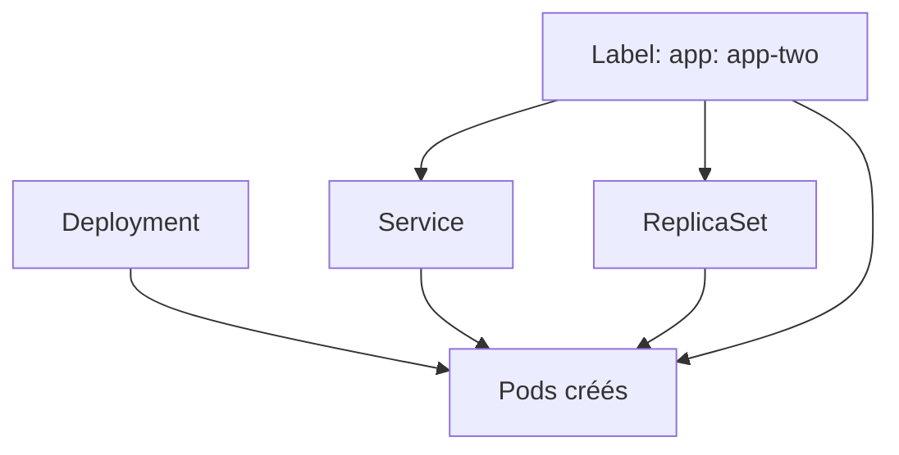

# Les labels Kubernetes

Un label Kubernetes est une étiquette clé/valeur ajoutée à une ressource.

Il sert à reconnaître et relier les objets entre eux.

## À quoi ça sert

Les labels permettent à Kubernetes de dire :

- ce Pod appartient à cette application ;
- ce Service doit envoyer le trafic vers ces Pods ;
- ce ReplicaSet doit gérer ces Pods.

## Exemple simple

```yaml
labels:
  app: app-two
```

Ici, `app: app-two` veut dire que la ressource appartient à l’application `app-two`.

## Lien entre les objets

- `spec.template.metadata.labels` applique le label aux Pods créés par le Deployment
- `spec.selector.matchLabels` cherche ce même label pour associer les Pods

Les deux doivent correspondre.

## Schéma simplifié



## Idée à retenir

Le label est le point de connexion entre les ressources Kubernetes.

Sans label identique, Kubernetes ne peut pas associer correctement le Service, le ReplicaSet et les Pods.